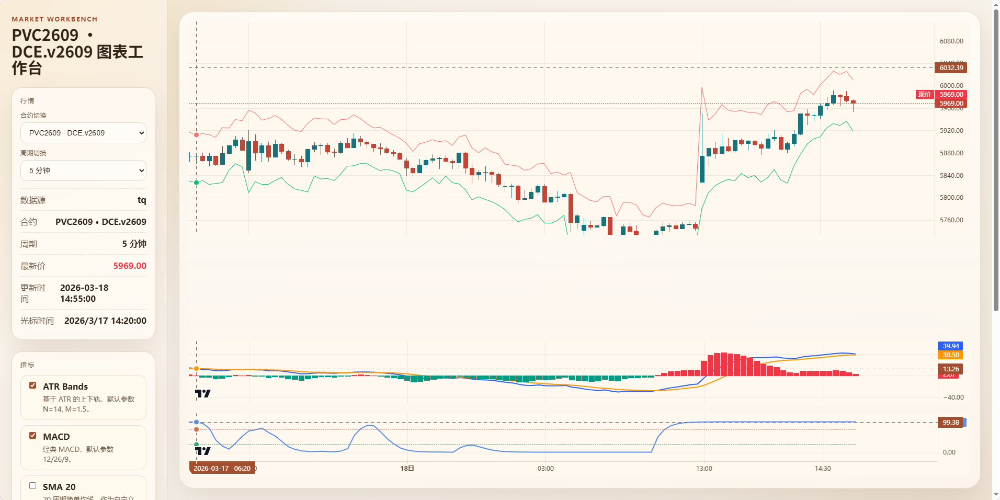

# TQ Chart Workbench

一个面向期货研究和回放的图表工作台。

这套项目现在已经形成两条清晰链路：

- `tq`：直接连接天勤，适合在线看盘和实时刷新
- `duckdb`：从本地 `DuckDB` 回放，适合历史复盘、`Tick / Range / Renko / 时间 K 线`

前端使用 `lightweight-charts`，后端负责数据源抽象、指标计算、合约映射和本地数据回放。

## 界面示例



## 当前能力

- 支持 `tq / duckdb` 双数据源切换
- 支持合约切换、周期切换、图表类型切换
- 支持 `时间 K 线 / Tick / Range / Renko`
- 支持主图、成交量、多个副图 pane
- 支持十字光标联动、时间联动
- 支持前端输入指标参数，后端实时计算
- 支持自定义指标动态加载
- 支持把历史 `tick` 归档到 `DuckDB`
- 支持把原生 `1m / 5m / 10m / 15m` K 线写入本地 `DuckDB`
- 本地源优先使用“最接近的现成数据”

## 项目结构

```text
.
├── web_tq_chart.py
├── custom_indicators.py
├── custom_indicators.example.py
├── static/
├── templates/
├── tq_app/
│   ├── web.py
│   ├── service.py
│   ├── contracts.py
│   ├── models.py
│   ├── data_sources/
│   └── indicators/
├── tick_archive/
├── scripts/
├── data/
│   └── duckdb/
└── experiments/
```

## 环境要求

- Python 3.11+
- 有效的天勤账号

## 安装

```bash
python -m venv myvenv
source myvenv/bin/activate
pip install -r requirements.txt
```

## 环境变量

项目根目录创建 `.env`：

```env
TQ_USER=你的天勤账号
TQ_PASSWORD=你的天勤密码
```

如果使用本地 `DuckDB` 数据源，还可以额外配置：

```env
DUCKDB_TICK_DB_PATH=data/duckdb/ticks.duckdb
DUCKDB_SOURCE_PROVIDER=tq
```

不配置时，默认会使用项目里的 `data/duckdb/ticks.duckdb`。

## 启动

默认启动：

```bash
./myvenv/bin/python web_tq_chart.py
```

默认访问地址：

```text
http://127.0.0.1:8050
```

如果你在 VS Code Remote / SSH / 容器环境里，希望更容易自动端口转发：

```bash
./myvenv/bin/python web_tq_chart.py --host 0.0.0.0 --port 8050
```

自动打开浏览器：

```bash
./myvenv/bin/python web_tq_chart.py --open-browser
```

## 常用启动参数

```bash
./myvenv/bin/python web_tq_chart.py \
  --provider duckdb \
  --symbol DCE.v2609 \
  --duration 300 \
  --length 800 \
  --bar-mode tick \
  --range-ticks 10 \
  --brick-length 10000 \
  --refresh-ms 800 \
  --host 0.0.0.0 \
  --port 8050
```

参数说明：

- `--provider`：数据源，当前支持 `tq`、`duckdb`
- `--symbol`：默认合约，例如 `DCE.v2609`
- `--duration`：时间 K 周期，单位秒
- `--length`：时间 K 默认请求根数
- `--bar-mode`：`time / tick / range / renko`
- `--range-ticks`：Range / Renko 的价格跨度，单位 tick
- `--brick-length`：`tick / range / renko` 默认显示根数
- `--refresh-ms`：刷新间隔，毫秒
- `--host`：监听地址
- `--port`：监听端口

## GitHub Actions 打包

仓库内置了跨平台打包工作流：

- 工作流文件：[.github/workflows/package.yml](.github/workflows/package.yml)
- `workflow_dispatch` 可手动触发
- 推送 `v*` 标签时会自动打包，并上传到 GitHub Release

当前默认覆盖这些构建目标：

- Linux `amd64`
- Linux `arm64`
- Windows `x86`
- macOS `arm64`

打包方式：

- 使用 `PyInstaller` 生成独立运行目录
- 自动打进 `templates/`、`static/`
- 自动包含 `custom_indicators.py`、`.env.example`、`README.md`、`LICENSE`

产物命名示例：

- `tq-chart-workbench-linux-amd64.tar.gz`
- `tq-chart-workbench-windows-x86.zip`
- `tq-chart-workbench-macos-arm64.tar.gz`

如果你本地也想先试打一次：

```bash
pip install pyinstaller
pyinstaller --clean tq_chart_workbench.spec
```

打包输出目录：

- `dist/tq-chart-workbench/`

## 前端能力

左侧控制区支持：

- 数据源切换
- 合约切换
- 周期切换
- 图表类型切换
- 价格 Tick 输入
- 显示根数输入
- 指标勾选与参数输入

右侧图表区支持：

- 主图 K 线
- 成交量 pane
- 多副图 pane
- 十字光标联动
- 光标时间显示
- `duckdb` 本地覆盖信息展示

## 指标

### 内置指标

- `ATR Bands`
- `MACD`
- `SMA 20`

### 当前自定义指标

项目根目录 [custom_indicators.py](custom_indicators.py) 里目前包含：

- `EMA 55`
- `STC`
- `Hull Suite`
- `多空线`
- `开仓许可线`
- `起爆捕捉逻辑`
- `震荡破裂启动识别`

## 自定义指标

系统会在启动时自动加载项目根目录的 `custom_indicators.py`。

要求：

- 文件里提供 `register_indicators(registry)`
- 每个指标继承 `Indicator`
- 返回 `IndicatorResult`

最小示例见 [custom_indicators.example.py](custom_indicators.example.py)。

如果希望前端自动生成参数输入框，需要在 `meta.params` 中声明参数。

## 数据源抽象

数据源注册在 [tq_app/data_sources/registry.py](tq_app/data_sources/registry.py)。

当前内置：

- `tq`
  直接连接天勤在线行情
- `duckdb`
  从本地 `DuckDB` 回放历史数据

后续如果要接入别的数据源，只需要：

1. 在 `tq_app/data_sources/` 下新增实现
2. 在 `registry.py` 里注册
3. 启动时通过 `--provider` 切换

前端和指标层不用跟着改。

## DuckDB 本地存储

当前本地主库位置：

- `data/duckdb/ticks.duckdb`

### 核心表

- `market_ticks`
  存所有合约的 `tick` 明细，按 `provider + symbol + ts_nano` 去重
- `contract_metadata`
  存合约映射、名称、交易所、最小变动、乘数、到期月等元信息
- `market_bars_1m`
  原生 `1m` K 线
- `market_bars_5m`
  原生 `5m` K 线
- `market_bars_10m`
  原生 `10m` K 线
- `market_bars_15m`
  原生 `15m` K 线

### 当前本地源优先级

`duckdb` 下会优先使用最接近的现成数据：

- `1m` 优先读 `market_bars_1m`
- `5m` 优先读 `market_bars_5m`
- `10m` 优先读 `market_bars_10m`
- `15m` 优先读 `market_bars_15m`
- 如果对应原生表没有数据，再回退到 `market_ticks` 聚合
- `tick / range / renko` 仍然以 `market_ticks` 为基础

### 设计原则

- 所有合约 `tick` 统一落一张事实表
- 合约元信息单独存表
- 时间 K 和 `tick` 存储层解耦
- 页面回放优先读最接近的本地现成数据

## 常用归档脚本

### 回灌 tick 到 DuckDB

```bash
./myvenv/bin/python scripts/archive_ticks_duckdb.py \
  --start-date 2024-01-01 \
  --end-date 2026-03-20 \
  --exchange-id DCE \
  --product-id v
```

### 回灌时间 K 到 DuckDB

```bash
./myvenv/bin/python scripts/archive_time_bars_duckdb.py \
  --db-path data/duckdb/ticks.duckdb \
  --provider tq \
  --symbols DCE.v2509 \
  --duration-seconds 300 \
  --start-date 2025-09-10 \
  --end-date 2025-09-12
```

### 批量回灌 5 分钟 K

```bash
./myvenv/bin/bash scripts/archive_5m_batch.sh
```

## 常见查询

查看某个合约的 tick 覆盖范围：

```sql
SELECT
  symbol,
  MIN(ts) AS first_tick_at,
  MAX(ts) AS last_tick_at,
  COUNT(*) AS tick_count
FROM market_ticks
WHERE provider = 'tq' AND symbol = 'DCE.v2609'
GROUP BY symbol;
```

查看某个合约的 `5m` 覆盖范围：

```sql
SELECT
  symbol,
  MIN(dt) AS first_bar_at,
  MAX(dt) AS last_bar_at,
  COUNT(*) AS bar_count
FROM market_bars_5m
WHERE provider = 'tq' AND symbol = 'DCE.v2609'
GROUP BY symbol;
```

查看 `PVC` 当前有哪些本地 tick：

```sql
SELECT
  symbol,
  MIN(ts) AS first_tick_at,
  MAX(ts) AS last_tick_at,
  COUNT(*) AS tick_count
FROM market_ticks
WHERE provider = 'tq' AND symbol LIKE 'DCE.v%'
GROUP BY symbol
ORDER BY symbol;
```

命令行直接查：

```bash
./myvenv/bin/python - <<'PY'
import duckdb

conn = duckdb.connect("data/duckdb/ticks.duckdb", read_only=True)
try:
    rows = conn.execute("""
        SELECT symbol, MIN(ts), MAX(ts), COUNT(*)
        FROM market_ticks
        WHERE provider = 'tq' AND symbol LIKE 'DCE.v%'
        GROUP BY symbol
        ORDER BY symbol
    """).fetchall()
    for row in rows:
        print(row)
finally:
    conn.close()
PY
```

## API

### `GET /api/config`

返回：

- 当前数据源
- 默认合约
- 合约友好名称
- 本地覆盖信息
- 周期选项
- 图表类型选项
- 指标元信息
- 默认启用指标

### `GET /api/snapshot`

常用参数：

- `provider`
- `symbol`
- `duration_seconds`
- `bar_mode`
- `range_ticks`
- `brick_length`
- `indicators`
- `indicator_params`

示例：

```text
/api/snapshot?provider=duckdb&symbol=DCE.v2609&bar_mode=renko&range_ticks=10&brick_length=3000&indicators=macd,stc
```

## 显示策略

- 指标预热阶段的数据优先只参与计算
- 初始视图优先显示指标已经形成有效值后的区间
- 价格轴上下留白会动态调整
- `tick / range / renko` 在前端按事件轴显示，同时保留真实时间标签
- `duckdb` 本地源下默认关闭自动轮询刷新

## 常见问题

### 启动了但没有页面

先确认服务是否成功启动，再访问：

```text
http://127.0.0.1:8050
```

远程环境建议使用：

```bash
./myvenv/bin/python web_tq_chart.py --host 0.0.0.0 --port 8050
```

### 提示没有天勤账号

检查 `.env`：

- `TQ_USER`
- `TQ_PASSWORD`

### 页面刷新后看不到自定义指标

检查：

- `custom_indicators.py` 是否有语法错误
- 是否提供了 `register_indicators(registry)`
- 是否已经重启服务

### DuckDB 下切换合约后没有变化

优先检查：

- 浏览器是否缓存了旧的 `static/app.js`
- 当前合约是否已有本地数据
- 是否已经重启服务并强刷页面

## 验证

前端语法检查：

```bash
node --check static/app.js
```

Python 编译检查：

```bash
./myvenv/bin/python -m compileall web_tq_chart.py tq_app custom_indicators.py
```

## License

本项目使用 MIT License，详见 [LICENSE](LICENSE)。
